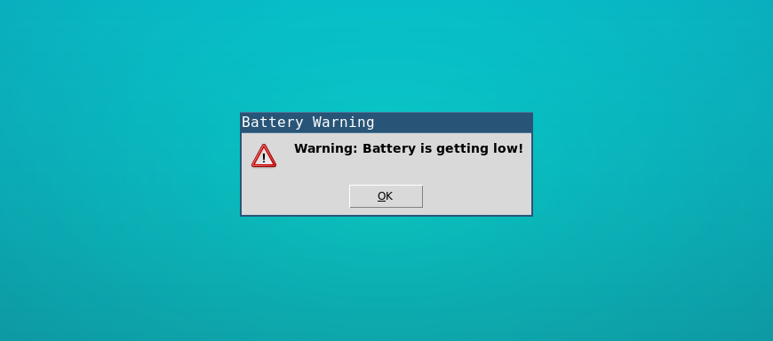
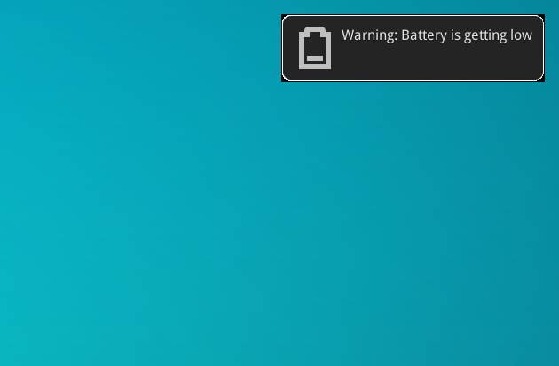

# i3-battery-popup
A script that shows messages to the user when the battery is almost empty. I wrote this because I use [i3wm](http://i3wm.org/), was frustrated by the lack of a nice battery notification, and as a nice exercise in shell scripting.

# What it does
This script regularly checks your battery charge and shows you a nice warning in a popup if you are about to completely drain your battery. It improves on other battery warning scripts [like this one](https://github.com/stagnation/i3-battery-warning) by:

- Using a Tk-based popup (if you want) which you can configure to show on all workspaces. i3's nagbar doesn't do that.
- Or using a nice `notify-send` desktop notification
- Using the nagbar if you prefer that - or if you don't have Tk.
- Optionally playing a sound to warn you when the battery gets low.
- Doing what you want: you can tell it at which battery percentages you want to be warned. Currently it will try to show you 2 messages before the lower limit is reached.
- Supporting multiple batteries. My laptop has 2 batteries, for example.

# How to use it

- Download the script and make sure it's on your `PATH`
- Call the script in your i3 config file: `exec --no-startup-id i3-battery-popup`

# Installing on Arch Linux
There's now a package on Arch Linux's AUR: https://aur.archlinux.org/packages/i3-battery-popup-git

## Showing the message everywhere

If you have `wish` installed this script will show you a popup window. To get wish, you probably need to install `tk` on your Linux distribution.

The nice thing is that we can make the popup window sticky; that doesn't work with i3-nagbar. To make the popup sticky so it shows everywhere, add this to your i3 config:

`for_window [title="Battery Warning"] sticky enable`

## Desktop notification

Specify `-n` to use those nice pretty desktop notifications in the top right corner of your screen. I guess it depends on something like `libnotify` but I'm not really sure. Please correct me if I'm wrong.

## Options

- `-L` : Sets the percentage at which the first popup shows. Default is `10%`
- `-l` : The percentage at which the second popup shows. Default: half of the percentage given by `-L`, not compatible with `-I`
- `-I` : Specify on how many battery % change to re-send message,    
      Note: the check is run every `-t` (default `5m`) so at minimum we will wait  `5m` before sending any new message, set `-t` lower for more precise interval notifications.    
      Disables the `-l` parameter    
      Example: `-I 2%` will send notfication every 2% battery change after `-L` was hit. Default: disabled

- `-m` : The message to show to the user    
      Default: `Warning: Battery is getting low`

- `-t` : The time interval the script waits before checking the battery again.
      Give this a value in seconds: `10s`, or in minutes: `5m`.
      Default: `5m`

- `-n` : Use notify-send for desktop notification

- `-i` : Specify the icon to use with `-n`

- `-N` : Don't use Tcl/Tk dialog. Use i3-nagbar.
- `-f` : Font to use for i3-nagbar
      Fonts are specified same as in i3 (https://i3wm.org/docs/userguide.html#fonts)    
      For example: `pango:DejaVu Sans Mono 10`

- `-s` : Play a sound with `paplay` when notifying.
      Takes a path to a sound as argument. The file must exist.
      Default: no sound.
      
- `-v` : Specifies the percentage of the volume of the sound played with `-s` option.
      This value must be an integer greater than `0` and smaller than `100`.
      Default: `100`

- `-D` : Enable debug output
- `-F` : Specifies the logfile to write to
